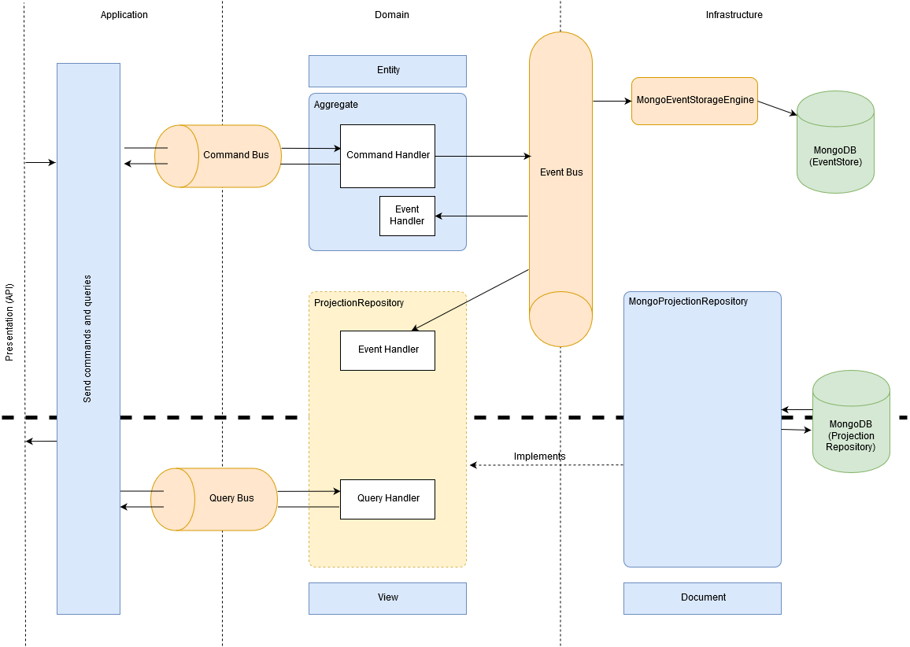

# CQRS et Event Sourcing

Nous avons décidé d'utiliser le framework Axon pour faciliter l'aspect CQRS/Event Sourcing de l'application.

Le principe *CQRS* (Command Query Responsability Segregation) consiste à séparer strictement les accès en écriture (Command) des accès en lecture (Query). Le pattern *Event Sourcing* consiste à stocker les évènements en plus de l'état final des données de l'application.

Axon n'impose pas d'utiliser l'Event Sourcing mais le permet. L'application existante fonctionne en Event Sourcing. Pour assurer la *rétrocompatibilité* avec l'existant, nous avons choisi d'utiliser ce pattern dans la nouvelle application.

Voici un schéma de l'architecture de la nouvelle application :

## Commands / Events / Aggregates

D'un côté, nous avons les *commandes*. Par exemple, CreateModuleCommand.

La couche Application, qui contient les cas d'utilisation d'un agrégat, émet une commande sur le *Command Bus*, géré par Axon.

Un agrégat, défini dans la couche Domain, intercepte cette commande à l'aide d'un *Command Handler*, puis émet un évènement. Par exemple : ModuleCreatedEvent.

Cet évènement transite sur l'*Event Bus* géré par Axon, est intercepté par un *Event Handler* et stocké dans un *Event Store*. De plus, l'état des données de l'application est mis à jour à partir de cet évènement. Nous avons choisi MongoDB pour l'Event Store et la base de données de l'état final.

À noter que les évènements, les commandes et les queries sont des objets *immuables*.

## Queries

De l'autre côté, nous avons les *requêtes* qui servent à récupérer des données qui seront envoyées au client de l'application.

La couche Application émet une requête sur le *Query Bus*. Elle est interceptée par un *Query Handler* déclaré dans la couche Domain et implémenté dans la couche Infrastructure.

Une requête retourne une *vue*, définie dans la couche Domain, qui est la représentation des données sous forme d'objet Java.

La façon dont les données sont effectivement récupérées (d'une base de données par exemple), dépend de l'implémentation dans laquelle se trouve le Query Handler.
