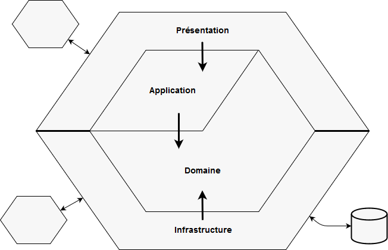

# DDD - Architecture hexagonale

L'architecture hexagonale mise en place est représentée par 4 couches :
* Présentation
* Application
* Domaine
* Infrastructure

## Présentation

La couche Présentation contient l'API (les endpoints), effectue le contrôle des inputs et renvoie les outputs. Inputs et outputs sont au format Json. Elle accède à la couche Application.

## Application

La couche Application contient la logique applicative, c'est-à-dire les cas d'utilisations associés aux agrégats (notion centrale en DDD, nous y revenons dans la couche Domain). Elle déclenche les commandes et les requêtes qui sont interceptées dans la couche Domaine et Infrastructure.

Par exemple, on vérifie qu'un module n'existe pas déjà, via une requête, avant le créer, via une commande.

La couche Application accède à la couche Domaine.

## Domaine

La couche Domaine ne dépend d'aucune autre couche et contient la logique Métier de l'application, c'est-à-dire les entités du domaine regroupées en agrégats. Un agrégat est un ensemble d'entités que l'on peut voir comme une unité. Souvent, il porte le nom de son entité racine. Une entité racine est le point d'entrée d'un agrégat. Les autres entités n'ont pas lieu d'être sans cette entité racine.

Un exemple simple : l'adresse postale du client d'une boutique n'a pas d'intérêt seule. Client et Adresse sont deux entités distinctes qui forment un agrégat dont l'entité racine est Client. On peut nommer cet agrégat Client.

Un exemple dans notre domaine : un Template est forcément lié à un Module. Le Template est une entité qui appartient à l'aggrégat Module.

La couche Domaine contient aussi :
* Les interfaces des Repository implémentées dans la couche infrastructure
* La définition des Command et Query qui transitent sur le Command Bus et le Query Bus
* Les erreurs sous forme d'exceptions

## Infrastructure

La couche Infrastructure *implémente* la couche Domaine.

Le domaine définit ce que le Repository *doit* faire. L'infrastructure implémente *comment* le faire.

Elle permet d'accéder aux partenaires externes. C'est ici qu'on trouve le "bruit technique" (accès à une base de données, à une ressource externe, etc.). Les interfaces *génériques* définies dans la couche Domaine sont implémentées de manière *spécifique* dans la couche Infrastructure.

