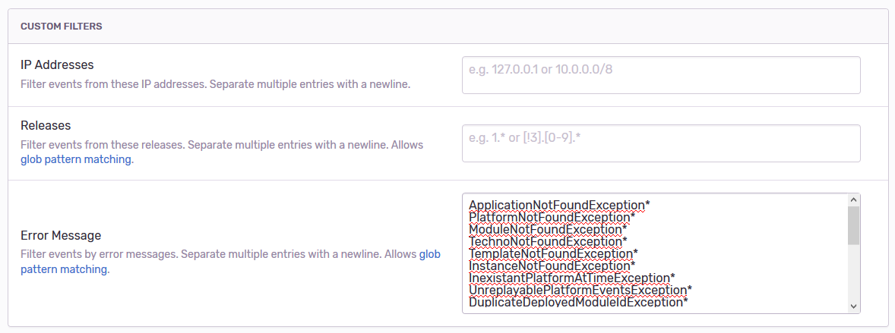

# Monitoring

## Logs

Le contrôle de leur niveau de verbosité est défini dans [application.yml](https://github.com/voyages-sncf-technologies/hesperides/blob/master/bootstrap/src/main/resources/application.yml)
et configurable via des variables d'environnement, comme par exemple :

    AGGREGATES_LOG_LEVEL=DEBUG
    VERSION_ID_LOG_LEVEL=DEBUG

## Prometheus

Un endpoint `/rest/manage/prometheus` est fourni via [PrometheusConfiguration.java](https://github.com/voyages-sncf-technologies/hesperides/blob/master/core/infrastructure/src/main/java/org/hesperides/core/infrastructure/monitoring/PrometheusConfiguration.java).
Les métriques exposées incluent les temps d'exécution de chaque requête HTTP, ainsi les durées de toutes les opérations sur le base MongoDB
(mesurés via l'annotation `@Timed`) et quelques autres métriques d'introspection MongoDB via [MongoHealthProbe.java](https://github.com/voyages-sncf-technologies/hesperides/blob/master/core/infrastructure/src/main/java/org/hesperides/core/infrastructure/mongo/monitoring/MongoHealthProbe.java).

## Sentry

Si la variable d'environnement `$SENTRY_DSN` est définie, Hesperides enverra toutes les exceptions levées à <https://sentry.io>.

Certains tags sont prédéfinis via le [Dockerfile](https://github.com/voyages-sncf-technologies/hesperides/blob/master/Dockerfile#L32)
et dans le code (_cf._ [SentryConfiguration.java](https://github.com/voyages-sncf-technologies/hesperides/blob/master/core/infrastructure/src/main/java/org/hesperides/core/infrastructure/monitoring/SentryConfiguration.java)),
mais il est possible de compléter cette configuration via des variables d'environnement :

    SENTRY_DSN=...
    SENTRY_ENVIRONMENT=PRD1
    SENTRY_IGNORED_EXCEPTIONS=PlatformNotFoundException,TemplateNotFoundException
    JAVA_OPTS=-Dsentry.stacktrace.app.packages=org.hesperides -Dsentry.http.proxy.host=my-proxt-host -Dsentry.http.proxy.port=80

Nous vous recommandons de filtrer les erreurs conventionnelles correspondant à des codes HTTP 4XX via l'interface de Sentry :

    ApplicationNotFoundException*
    PlatformNotFoundException*
    ModuleNotFoundException*
    TechnoNotFoundException*
    TemplateNotFoundException*
    DeployedModuleNotFoundException*
    InstanceNotFoundException*
    InexistantPlatformAtTimeException*
    UnreplayablePlatformEventsException*
    DuplicateDeployedModuleIdException*
    DuplicateModuleException*
    DuplicatePlatformException*
    DuplicateTechnoException*
    OutOfDateVersionException*
    IllegalArgumentException*
    MissingServletRequestParameterException*
    UpdateReleaseException*
    InvalidPropertyValorisationException*
    InvalidTemplateException*
    ForbiddenOperationException*
    AccessDeniedException*
    RequiredPropertyNotValorisedException*
    MethodArgumentNotValidException*
    MustacheException
