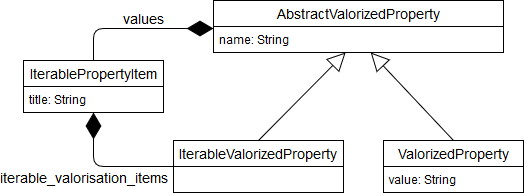

## Application

    {
      "name": "",
      "platforms": [
        {
          "platform_name": "",
          "application_name": "",
          "application_version": "",
          "production": false,
          "modules": [
            {
              "name": "",
              "version": "",
              "working_copy": false,
              "properties_path": "",
              "path": "",
              "instances": [
                {
                  "name": "",
                  "key_values": [
                    {
                      "name": "",
                      "value": ""
                    }
                  ]
                }
              ],
              "id": 0
            }
          ],
          "version_id": 0
        }
      ]
    }

## Plateforme

    {
      "application_name": "",
      "application_version": "",
      "platform_name": "",
      "production": false,
      "version_id": 0,
      "modules": [
        {
          "id": 0,
          "name": "",
          "version": "",
          "path": "",
          "working_copy": false,
          "properties_path": "",
          "instances": [
            {
              "name": "",
              "key_values": [
                {
                  "value": "",
                  "name": ""
                }
              ]
            }
          ]
        }
      ]
    }

## Propriétés globales

    {
      "": [
        {
          "inModel": false,
          "path": ""
        }
      ],
      "": []
    }

Attention, l'output n'est pas un tableau...

## Propriétés valorisées

    {
      "key_value_properties": [
        {
          "name": "",
          "value": ""
        }
      ],
      "iterable_properties": [
        {
          "name": "",
          "iterable_valorisation_items": [
            "title": "",
            "values": [
              {
                "name": "",
                "value": ""
              },
              {
                "name": "",
                "iterable_valorisation_items": []
              }
            ]
          ]
        }
      ]
    }

Diagramme des classes d'output :

## Propriétés d'instances

    {
      "keys": [
        {
          "name": "",
          "required": false,
          "comment": "",
          "defaultValue": null,
          "pattern": null,
          "password": false
        }
      ]
    }

## Liste des plateformes d'un module

    [
      {
        "application_name": "",
        "platform_name": ""
      }
    ]