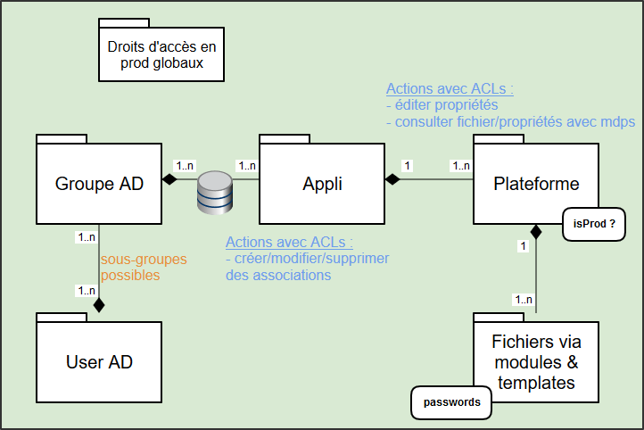

# Access control

Dans le but de permettre un contrôle fin des accès en lecture & écriture aux données,
nous intégrons dans Hesperides un mécanisme d'[ACLs](https://fr.wikipedia.org/wiki/Access_Control_List).

<!-- Pour mettre à jour ce sommaire: 
    markdown-toc --indent "    " -i access_control.md
-->

<!-- toc -->

- [Besoin fonctionnel](#besoin-fonctionnel)
- [Design](#design)
- [Ressources REST](#ressources-rest)
    * [GET /users/auth](#get-usersauth)
    * [GET /applications/$APP](#get-applicationsapp)
    * [GET /applications/$APP?with_passwords_count=true](#get-applicationsappwith_passwords_counttrue)
    * [PUT /applications/$APP](#put-applicationsapp)
- [Détails notables d'implémentation](#details-notables-dimplementation)
    * [Algorithme de collecte des _authorities_](#algorithme-de-collecte-des-_authorities_)
    * [Caches](#caches)

<!-- tocstop -->

## Besoin fonctionnel
- associer des droits de lecture & édition par plateforme, et y lier les restrictions d'accès aux **mots de passe** sur les plateformes de **production**
- s'intégrer avec un annuaire _Active Directory_ et à des normes de nommage de groupes pré-existantes
(incluant des cas de sous-groupes, avec transmissions de droits correspondants)
- déléguer la gestion des droits aux utilisateurs, pour les rendre autonomes


## Design

Globalement, l'ajout de ces fonctionnalités entraine quelques ajouts structurels :
- à chaque plateforme est associé un "privilège" Spring Boot (`authority`) : `${APP}_PROD_USER`
- une nouvelle collection dans la base de données fait le lien entre `${APP}_PROD_USER` et groupes _Active Directory_
- de nouvelles ressources dans le _endpoint_ `/users`, détaillées ci-dessous
- à chaque appel aux ressources `/platforms`, `/files` & `/users` ces privilèges sont consultés pour déterminer les opérations autorisées,
et si les mots de passes doivent être obfusqués




## Ressources REST

### GET /users/auth
Ajout de 3 champs dans la réponse.

**Input**: le _login_ de l'utilisateur (pour l'instant via la `Basic Auth`)

**Output** nominal: la liste exhaustive des groupes ActiveDirectory auxquels l'utilisateur appartient, et la liste des applications où il a des droits de prod
```
{
  "username": "...",
  "prodUser": true,
  "techUser": false,
  "authorities": [
    {"role": "GLOBAL_IS_PROD"},
    {"role": "ABC_PROD_USER"},
    {"role": "DEF_PROD_USER"},
    {"groupCN": "GG_XX"},
    {"groupCN": "GG_YY"}
  ]
}
```

Ici les `authorities` sont issues de la gestion de rôles de [Spring Boot](https://www.baeldung.com/role-and-privilege-for-spring-security-registration).
Elles sont de 3 types :
- **globales** : en reprennant les rôles historiques `GLOBAL_IS_PROD` (`= prodUser`) & `GLOBAL_IS_TECH` (`= techUser`)
- **par application** : les nouveaux privilèges `${APP}_PROD_USER`
- **groupes ActiveDirectory indicatifs**, incluant les groupes parents et tous les ancêtres

**Error**: `401` si les _credentials_ de l'utilisateur sont invalides.

### GET /applications/$APP
Ajout d'un champ `authorities` dans la réponse.

**Output**: 
```
{
    "name": "ABC",
    "authorities": {
        "ABC_PROD_USER": ["GG_XX", "GG_ZZ"]
    },
    "platforms: [ ... ]
}
```

### GET /applications/$APP?with_passwords_count=true
Ajout de ce _query parameter_.

**Besoin** : pouvoir identifier les plateformes nommées "PRDx" contenant des mots de passes,
mais non classifiées comme "production".

**Output**:
```
{
    "name": "ABC",
    "authorities": {
        "ABC_PROD_USER": ["GG_XX", "GG_ZZ"]
    },
    "platforms: [{
        "name": "PRD1",
        "production": true,
        "passwordsCount": 4
    }, ... ]
}
```

### PUT /applications/$APP
Permet de mettre à jour la propriété `authorities` d'une application.

**Droits de modification des `authorities`**: ce champ ne peut être modifié que lorsqu'il est initialement vide
OU que l'utilisateur effectuant la modification appartient a l'un des groupes dans `authorities`. Dans le cas contraire, une `401` est retournée.


## Détails notables d'implémentation

### Algorithme de collecte des _authorities_

**Contrainte de performances** : Historiquement, Hesperides effectuait un appel à l'ActiveDirectory par connexion d'utilisateur et par rôle (`prodUser` / `techUser`),
via une requête `(memberOf:$oid:=$groupDN)`.

Avec désormais potentiellement plusieurs groupes ActiveDirectory associés à chaque application,
pour plus d'une centaine d'applications, cela signifierait - en moyenne et en ordre de grandeur - une centaine de requête `memberOf` par connexion d'utilisateur.

Cette approche n'étant donc plus envisageable en terme de charge générée sur l'ActiveDirectory,
pour minimiser ce nombre d'appels Hesperides va désormais collecter la liste de tous les groupes parents de l'utilisateur,
transitivement et avec un cache.

Voici donc le nouvel algorithme de collecte des `authorities` par connexion d'utilisateur :
1. un appel systématique à l'ActiveDirectory pour récupérer la liste des groupes directement parents, via une requête `memberOf`.
2. on résoud la liste exhaustive des groupes parents en bénéficiant d'un cache, générant entre 0 et `N` appels
(avec `N` la profondeur maximum de l'arbre des groupes parents, et donc très peu élevé).
3. on compare cette liste exhaustive de groupes parents avec ceux configurés pour correspondre aux rôles `GLOBAL_IS_PROD` / `GLOBAL_IS_TECH`
afin de déterminer si l'utilisateur les possède.
4. on requête la base de données d'Hesperides pour obtenir la liste des privilèges `${APP}_PROD_USER` associés aux groupes de l'utilisateur.
Une seule requête est nécessaire.


### Caches

Deux caches sont mis en place au niveau de la gestions des `authorities` :

- par utilisateur, ses `authorities` sont mémorisées dans un cache avec TTL de 5 minutes et comme clef son _login_
- globalement, l'arbre des dépendances entre groupes ActiveDirectory étant mis en cache, avec pour chaque groupe un TTL de 1 heure

Malgré ces caches, comme Hesperides est _stateless_ et qu'aucune information relative à l'utilisateur n'est stockée en base de données,
l'_ActiveDirectory_ est toujours consulté au moins une fois par connexion d'utilisateur.

